# 主要功能

导入TXT文档之后，将按照原文的换行符进行拆分双语展示。用户可以对接支持OpenAI API风格的所有LLM模型进行翻译。

# 设计

软件整体布局为：

窗口最顶部标题栏显示当前编辑中文件，此处使用系统窗口Title实现

窗口左侧为菜单栏，主要工具从上到下顺序排列在菜单栏上，菜单栏右侧和菜单栏等高的按钮点击可以收纳或者展开菜单栏。

当前选择中的菜单按钮高亮，文字加粗显示。

窗口右侧为工作区。

菜单栏和工作区的可以由用户通过中间的分界线手动调整横向宽度

默认菜单展开的时候如下图所示：

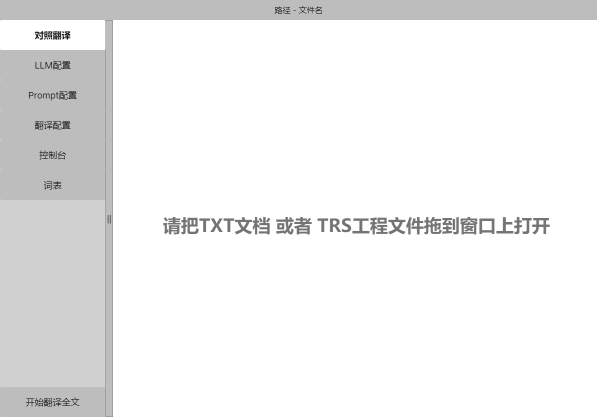

当点击菜单栏右和工作区中间的分界线折叠菜单栏，则全窗口都是工作区，如下图所示：

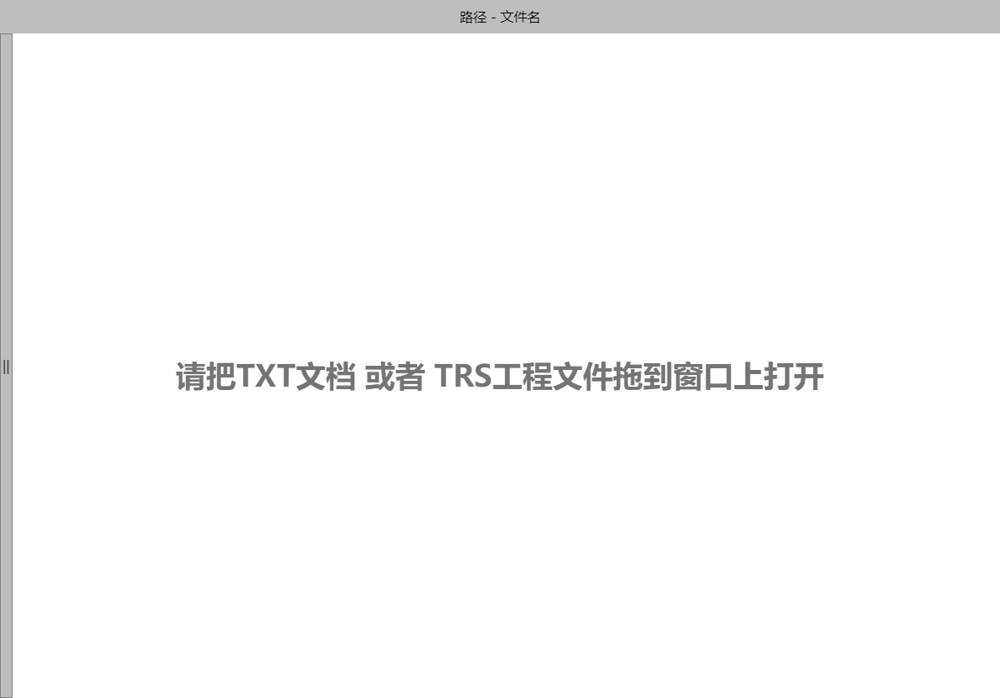

## 对照翻译页面

对照翻译页面主要工作区域，工作的时候使用双语的文本块进行显示，如果未打开文件，则"**请把TXT文档 或者 TRS工程文件拖到窗口上打开**" 使用加粗文字，在工作区居中显示。整体效果如下图：


用户可以通过拖放，将文件拖放到窗口打开。

具体文件打开设计见后文。

当打开文本后，效果如图：

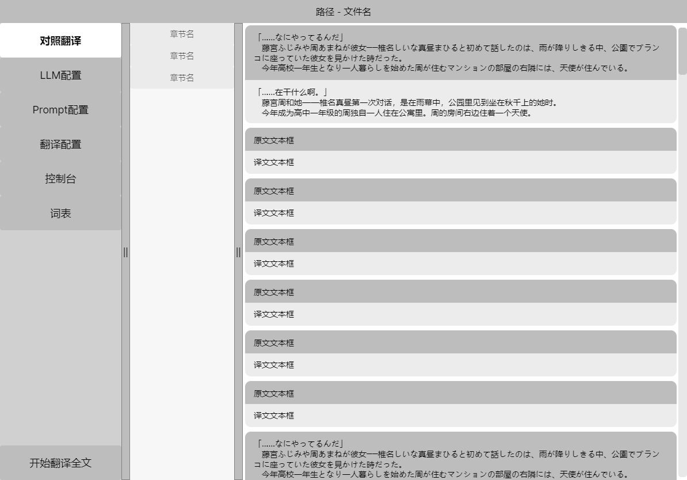

工作区分成左右两侧，左侧为章节栏，右侧文正文双语对照工作区。

章节栏上面每一个章节选项，点击右键都可以进入编辑模式，可以编辑章节名称。

章节栏和正文工作区中间的分界线可以由用户操作编辑调整宽度，和菜单栏一样。

章节栏右侧包含一个和窗口等高的折叠按钮，点击后可以折叠章节显示。和菜单栏一样的设计

当菜单栏折叠后，效果如下图所示：

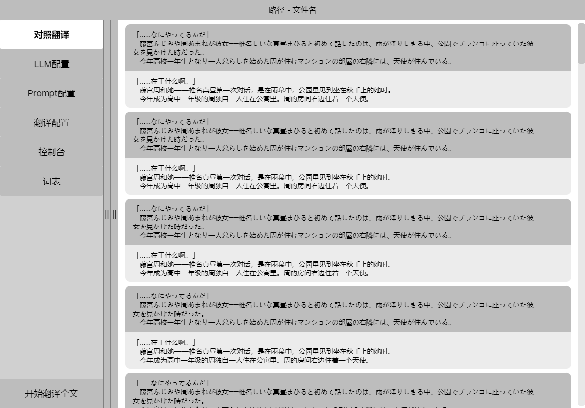

双语文本框的宽度动态适应工作区宽度，高度动态适配文本换行长度，文本框采用多行文本框，允许后续用户合并多行。

文本框设计如下图：

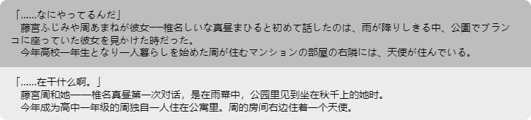

文本框上半部分为原文显示，下半部分为译文显示。上半部分背景颜色比下半部分稍微更深。文本框使用5px的圆角，边框宽度10px。

如果只有原文没有译文，或者只有译文没有原文，则没有文本的部分保留一行的高度。

只有原文没有译文，如下图所示：

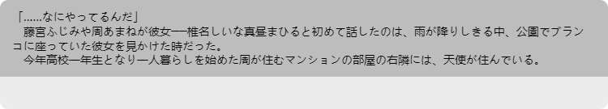

点击文本框即可直接编辑文本，原文译文皆可。鼠标可以左键点击指定编辑游标在文本中的位置。

当在文本框点右键的时候，游标位置会移动到文本对应位置，并且弹出右键菜单：

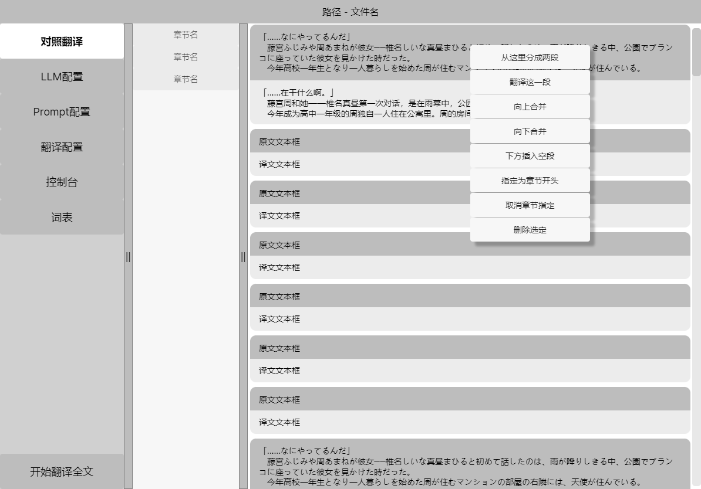

右键菜单包含了如下选项：

### 从这里分两段：

从游标所在位置，对当前文本框的文本拆分成两段，变成两个文本框。

如果没有译文，则直接拆分成两个文本框即可。

如果已经有译文的情况下：

-   如果选中的是原文文本，则先拆分原文，再将拆分后的原文使用"原文拆分Prompt"向LLM发起请求，并且接受LLM返回的译文的拆分结果。
-   如果选中的是译文文本，则先拆分译文，再将拆分后的译文使用"译文拆分Prompt"向LLM发起请求，并且接受LLM返回的原文的拆分结果。
-   原文和译文都获得了拆分结果之后再变成两个文本框
-   Prompt以及处理的详细信息在后文Propmt和翻译部分详细描述

### 翻译这一段：

以当前文本框为中心，同时收集上文和下文的其他文本原文，直到达到用户配置中指定的译文长度上限，或者已经没其他文本框可以收集。然后使用"翻译Prompt"向LLM发起请求，并且等待接收LLM返回的译文结果，按格式拆分之后，按当前原文在整体提交的译文中的索引获取对应结果。

Prompt以及处理的详细信息在后文Propmt和翻译部分详细描述。

### 向上合并：

将当前的原文和译文和上一段合并

### 向下合并：

将当前的原文和译文和下一段合并

### 下方插入空段：

在当前文本后面插入新的空文本框

### 指定为章节开头：

将当前选中的文本框指定为一个章节开头，并且更新章节显示列表。当从章节显示列表点击对应章节的时候，正文工作区显示将会滚动到当前位置显示。指定为章节开头的时候，默认截取当前文本译文的前五个字作为章节标题显示。如果没有译文，就截取原文。

### 取消章节指定：

取消将当前文本框的章节开头标记。如果选定的文本框没有章节标记，则此选项为Disable状态。

### 删除选定：

删除选定的文本框和内容。

## LLM配置

此功能页面用于配置LLM服务，如下图所示：

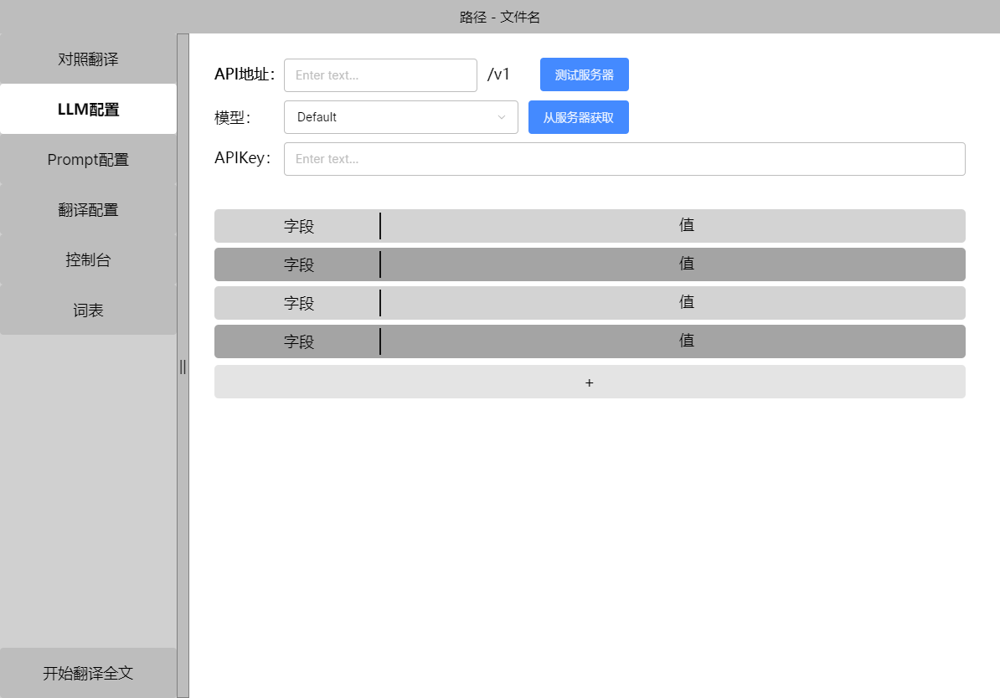

### API地址栏：

允许用户填写一个URL，无需填写URL后续的/v1等其他API功能

### 模型栏：

是一个下拉菜单，允许用户手动填写模型名，也可以点击右侧"从服务器获取"按钮，从LLM服务器获取模型列表。或者模型列表成功之后，则可以从下拉菜单中选中模型名。

点击获取按钮后，通过GET `http://api地址/v1/models` 可以获取模型列表信息

### API Key栏：

是一个密码输入框，用于用户填写API Key

### 字段配置：

API Key的配置下方是向LLM请求时候附带的字段参数，允许用户点击添加。每一栏是一个字段，左侧用户填写字段名，右侧填写值。

下方有增加按钮可以点击增加。

选中字段之后按Delele按键，或者字段左侧红色的删除按钮可以删除字段。如下图：

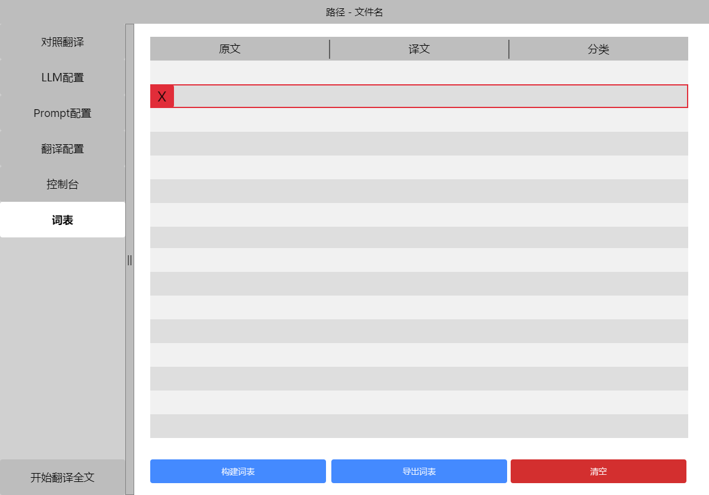

默认字段包含：

-   `temperature = 0`
-   `stream = True`

### 测试服务器：

点击测试服务器按钮，向LLM服务器POST如下的请求，如果能完整接收回复，并且在返回的json的choices字段里面找到role为assistant的内容，则表示连接成功，按钮显示为绿色。否则连接失败，将按钮显示为红色。

POST `http://api地址/v1/chat/completions`

以下为请求内容，使用`application/json`

```json
{
  "model": "Mistral-Small-24B-Instruct-2501-Q6_K.gguf:latest",
  "temperature": 0.7,
  "messages": [
    {
      "role": "user",
      "content": "自我介绍"
    }
  ],
  "top_p": 0.9,
  "top_k": 40,
  "n": 40
}
```

测试服务器按钮效果如下：

连接成功的时候：

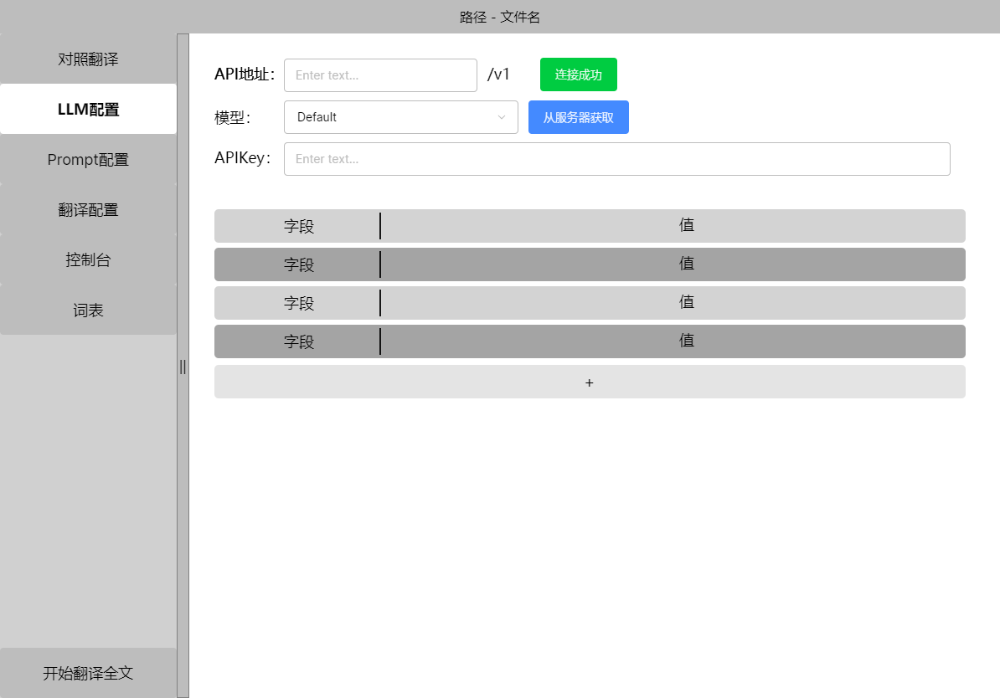

连接失败的时候：

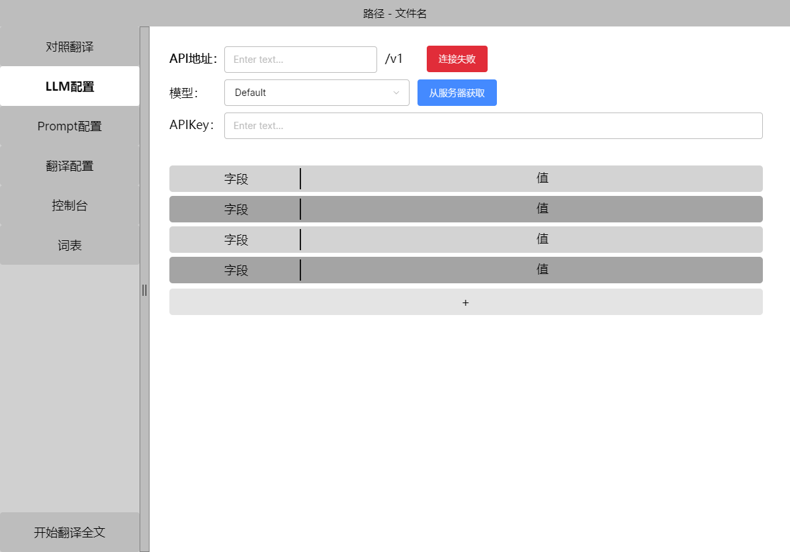

## Prompt配置

在此页面可以进行LLM翻译的Prompt配置，包含翻译Prompt，原文分分段Prompt和译文分段Prompt：

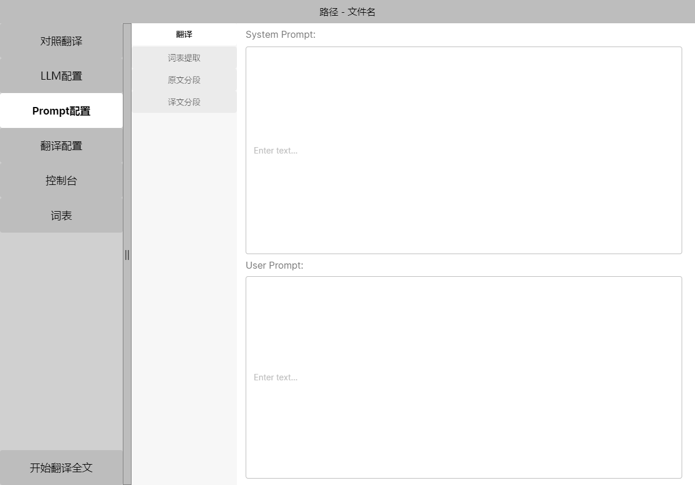

在工作区左侧可以选择一种Prompt进行编辑。工作区右侧的文本框可以填写对应的Prompt

以下是默认Prompt：

### 翻译System Prompt：

```text
你是一个轻小说翻译模型，可以流畅通顺地以轻小说的风格将{src_lang}翻译成{dst_lang}，并联系上下文正确使用人称代词，不擅自添加原文中没有的代词。

翻译的时候，请参考以下翻译词表：
{word_table}

用->符号作为每一个段的开始标记，翻译的时候->没有内容上的含义。不要作出然后解释和回答，直接输出译文翻译即可。以下是格式参考：

输入为：
-> 「......なにやってるんだ」
-> 　藤宮ふじみや周あまねが彼女──椎名しいな真昼まひると初めて話したのは、雨が降りしきる中、公園でブランコに座っていた彼女を見かけた時だった。
-> 　今年高校一年生となり一人暮らしを始めた周が住むマンションの部屋の右隣には、天使が住んでいる。
-> 　天使というのはもちろん比喩であるが、その比喩が冗談ではないほどに椎名真昼は美しく可憐かれんな少女だ。

输出为：
-> 「......在干什么啊。」
-> 　藤宮周和她------椎名真昼第一次对话，是在雨幕中，公园里见到坐在秋千上的她时。
-> 　今年成为高中一年级的周独自一人住在公寓里。周的房间右边住着一个天使。
-> 　当然这只是比喻而已，但这个比喻并不夸张------椎名真昼是个美丽可爱的少女。
```

### 翻译User Prompt：

```text
{prompt}
```

### 词表提取System Prompt：

```text
你是一个文本词表提取模型，可以从给定的{src_lang}文本里面提取各类型名称，并且翻译{dst_lang}，并且将词语分类到以下的几个类型里面：角色，道具，地点，其他。

不要作出然后解释和回答，直接输出词表即可。以下是格式参考：

输入为：
藤宮ふじみや周あまねが彼女──椎名しいな真昼まひると初めて話したのは、雨が降りしきる中、公園でブランコに座っていた彼女を見かけた時だった。
今年高校一年生となり一人暮らしを始めた周が住むマンションの部屋の右隣には、天使が住んでいる。

输出为：
[["藤宮ふじみや周", "藤宮周", "角色"], ["椎名しいな真昼", "椎名真昼", "角色"], ["公園","公园","地点"], ["ブランコ","秋千","道具"]]
```

### 词表提取User Prompt：

```text
{prompt}
```

### 原文拆分System Prompt：

```text
你是一个双语校对翻译模型，完成原文段落拆分之后，对译文重新拆分的任务。根据拆分前后的原文，可以正确的对译文进行拆分，不擅自重新翻译，不要做出然后解释和回答，直接给出正确拆分后的译文即可。

用->符号作为每一个段的开始标记，翻译的时候->没有内容上的含义。输出的时候请带上->符号作为拆分每一段的开头。以下是格式参考：

输入为：
拆分前原文：藤宮ふじみや周あまねが彼女──椎名しいな真昼まひると初めて話したのは、雨が降りしきる中、公園でブランコに座っていた彼女を見かけた時だった。今年高校一年生となり一人暮らしを始めた周が住むマンションの部屋の右隣には、天使が住んでいる。
拆分前译文：藤宮周和她------椎名真昼第一次对话，是在雨幕中，公园里见到坐在秋千上的她时。今年高校一年生となり一人暮らしを始めた周が住むマンションの部屋の右隣には、天使が住んでいる。
拆分后原文为：
->藤宮ふじみや周あまねが彼女──椎名しいな真昼まひると初めて話したのは、雨が降りしきる中、公園でブランコに座っていた彼女を見かけた時だった。
->今年高校一年生となり一人暮らしを始めた周が住むマンションの部屋の右隣には、天使が住んでいる。

输出为：
->藤宮周和她------椎名真昼第一次对话，是在雨幕中，公园里见到坐在秋千上的她时。
->今年成为高中一年级的周独自一人住在公寓里。周的房间右边住着一个天使。
```

### 原文拆分User Prompt:

```text
拆分前原文：{src_before_split}
拆分前译文：{trans_before_split}
拆分后原文为：
->{src_split_00}
->{src_split_01}
```

### 译文拆分System Prompt:

```text
你是一个双语校对翻译模型，完成译文段落拆分之后，对原文重新拆分的任务。根据拆分前后的译文，可以正确的对原文进行拆分，不擅自重新翻译，不要做出然后解释和回答，直接给出正确拆分后的原文即可。

用->符号作为每一个段的开始标记，翻译的时候->没有内容上的含义。输出的时候请带上->符号作为拆分每一段的开头。以下是格式参考：

输入为：
拆分前原文：藤宮ふじみや周あまねが彼女──椎名しいな真昼まひると初めて話したのは、雨が降りしきる中、公園でブランコに座っていた彼女を見かけた時だった。今年高校一年生となり一人暮らしを始めた周が住むマンションの部屋の右隣には、天使が住んでいる。
拆分前译文：藤宮周和她------椎名真昼第一次对话，是在雨幕中，公园里见到坐在秋千上的她时。今年高校一年生となり一人暮らしを始めた周が住むマンションの部屋の右隣には、天使が住んでいる。
拆分后译文为：
->藤宮周和她------椎名真昼第一次对话，是在雨幕中，公园里见到坐在秋千上的她时。
->今年成为高中一年级的周独自一人住在公寓里。周的房间右边住着一个天使。

输出为：
->藤宮ふじみや周あまねが彼女──椎名しいな真昼まひると初めて話したのは、雨が降りしきる中、公園でブランコに座っていた彼女を見かけた時だった。
->今年高校一年生となり一人暮らしを始めた周が住むマンションの部屋の右隣には、天使が住んでいる。
```

### 译文拆分User Prompt:

```text
拆分前原文：{src_before_split}
拆分前译文：{trans_before_split}
拆分后译文为：
->{trans_split_00}
->{trans_split_01}
```

## 翻译配置

翻译配置页面用于给用户配置翻译相关的参数。布局如下图所示：

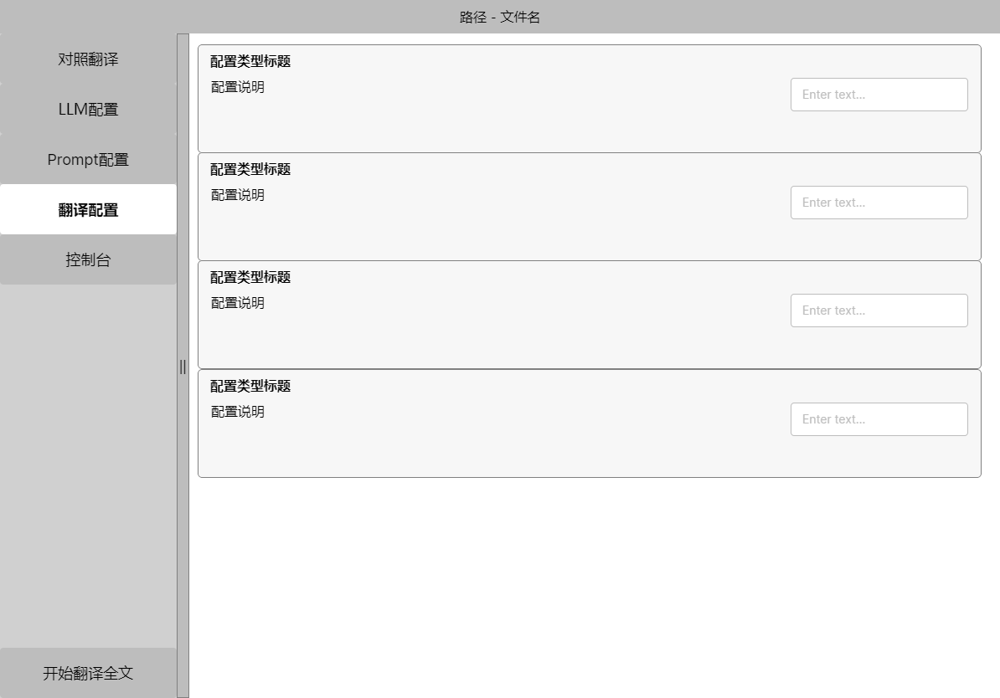

翻译配置功能在工作区从上一项下排列，每个配置功能都遵从相同的布局，配置选项布局如下：

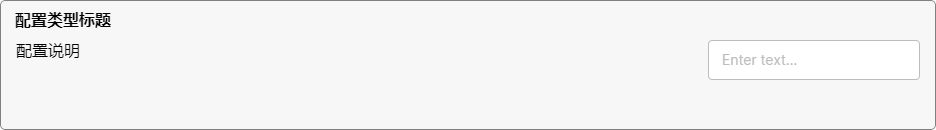

顶部一行靠左对齐是功能Title，用加粗字体显示，内容是当前选项的名称

标题下方是左对齐的配置项简介文本。

右侧是居中的项参数配置输入框，根据类型可以分成文本输入，数字输入，Checkbox，以及下拉菜单。

### 翻译配置项：

#### 最大文本长度：

-   **功能**：一次提交LLM的最大原文长度。
-   **类型**：整数
-   **默认值**：500

#### 原文语言：

-   **功能**：原文语言选项
-   **类型**：下拉菜单
-   **选项包括**：简体中文，繁体中文，英文，日文。
-   **默认值**：日文

#### 译文语言：

-   **功能**：译文语言选项
-   **类型**：下拉菜单
-   **选项包括**：简体中文，繁体中文，英文，日文。
-   **默认值**：简体中文

#### 并发任务阈值：

-   **功能**：同时执行翻译任务的最大值
-   **类型**：整数
-   **默认值**：1

#### 每分钟任务数量阈值：

-   **功能**：每分钟发起的最大任务数量，如果设置为0，则视为不限制
-   **类型**：整数
-   **默认值**：0

#### 超时阈值：

-   **功能**：请求等待的最长时间（秒），如果超时未收到回复，则视为失败。
-   **类型**：浮点数
-   **默认值**：120

#### 任务重试阈值：

-   **功能**：当一个任务失败，则发起重试。直到任务完成，或者超过重试阈值。
-   **类型**：整数
-   **默认值**：16

#### 自动保存时间：

-   **功能**：自动保存工程的时间间隔(秒)
-   **类型**：浮点数
-   **默认值**：60

## 开始翻译按钮

左侧菜单栏的底部是开始翻译按钮。如果没加载任何文本，该按钮为Disabled。

点击之后，将会开始自动收集原文，进行翻译任务。

如果是有部分文件有译文，则会弹出对话框，询问用户是否继续翻译，是的话则从未翻译部分开始继续，否则将从头开始翻译。

按钮本身即为翻译进度条，如图所示：

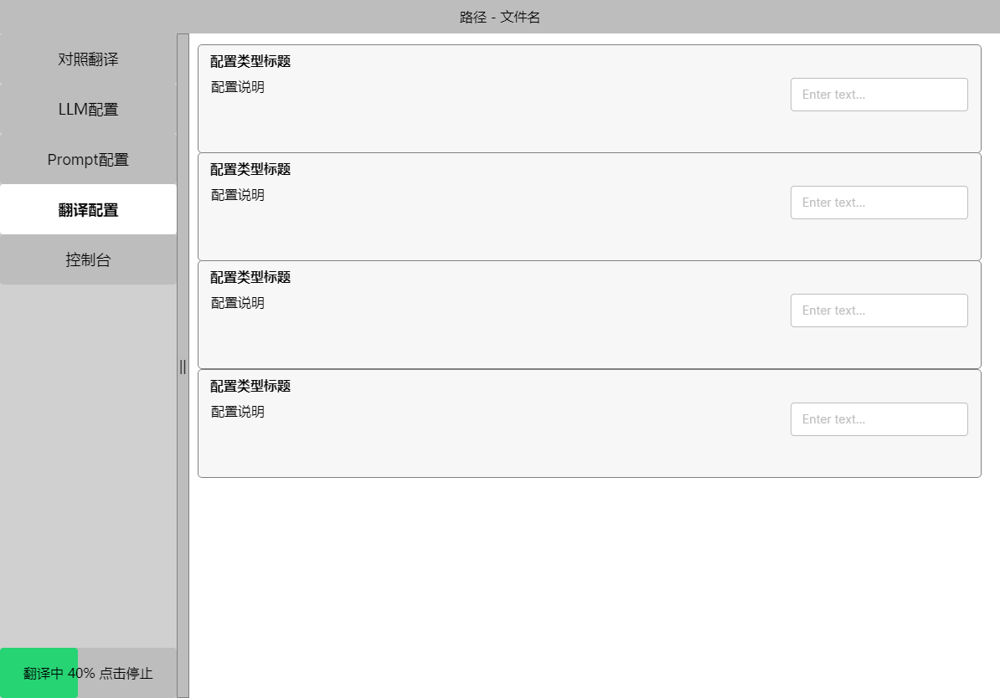

点击开始翻译之后，按钮会显示为翻译中，并且显示进度百分比。此时点击按钮的功能变成停止翻译。

开始翻译的时候，按钮本身会变成进度条的样式，从左到右，按翻译百分比显示进度条，完成的部分显示为绿色

点击停止之后，将会弹出对话框，要求用户确认是否停止。

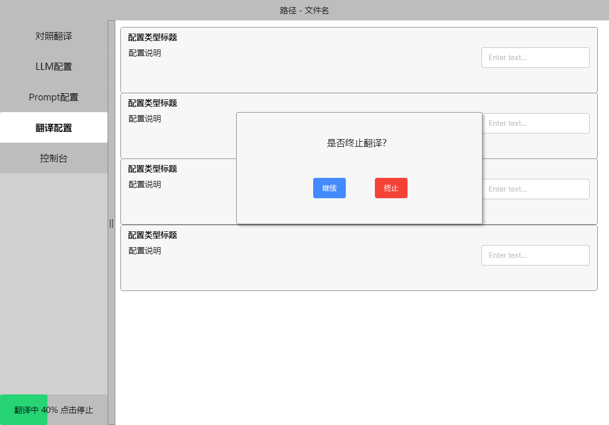

如果用户点继续，将关闭对话框，翻译继续进行；如果点击终止按钮，则终止翻译，并关闭终止翻译对话框。开始翻译按钮恢复到初始状态。

## 控制台

控制台用于输出所有运行过程中的Log信息。

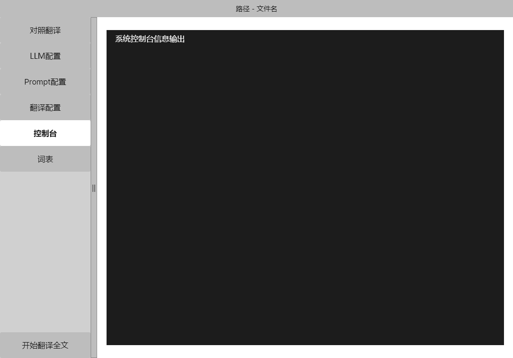

工作区是控制台的输出窗口，软件不使用另外的控制台窗口，而是将控制台作为一个菜单页面提供。控制台只输出信息，用户不可以输入任何内容。

## 词表

词表菜单用于向用户提供一个构建翻译词表的功能。页面如下：

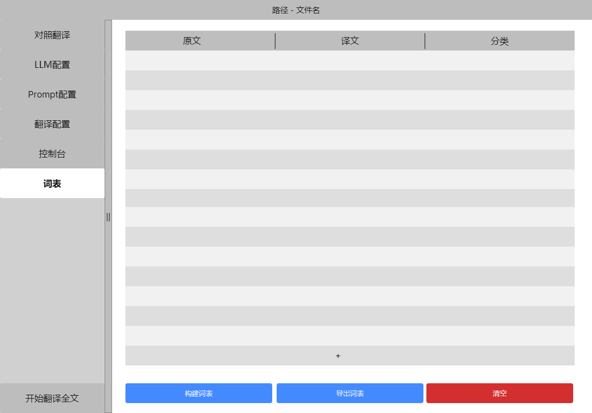

工作区是一个三列的表格，依次是 原文，译文，分类。

表格用于显示和编辑词表，点击表格每一项即可填写和修改内容。

表格的下方有一个+按钮，点击即可创建一个新项。

当选中表格的其中一项的时候，将可以点击左侧的删除按钮进行删除，如图所示：


或者选中表格的一列之后按Delete按键，即可删除一列

点击下方构建词表功能，即可调用LLM的API，对原文提取词表，点击之后，构建词表的按钮变成进度条，再次点击可以终止构建，如图所示：

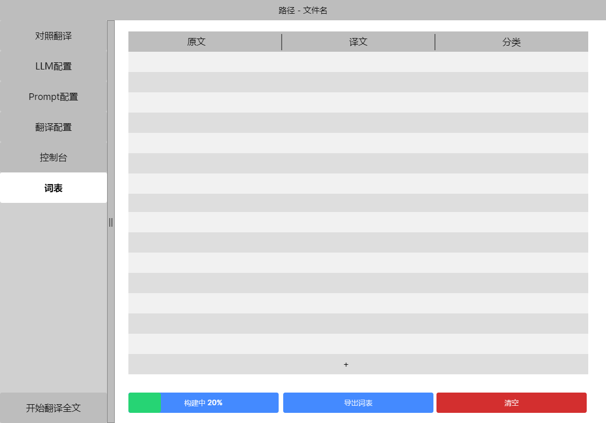

点击导出词表，可以按json格式的数组导出词表，格式为：

```json
[["原文", "译文", "分类"],]
```

点击清空按钮，即可清空整个词表。

## 翻译功能设计

### 翻译：

按顺序从原文中按段收集文本，直到等于或者大于用户设置的最大文字数。一个文本框的文本视为一段，不按换行符区分。然后将每段文本前面添加上`->`作为格式组织prompt：

```text
-> 段1
-> 段2
-> 段3
```

构建完成之后，先用词表提取的功能，提取准备翻译的文本包含的关键词，然后把提取到的词逐个从词表中查找对应的译文，然后按以下格式组织成以下的格式：

`"原文"翻译成"译文"，"原文"翻译成"译文"...`

将组织起来的翻译词表提示，替换翻译system prompt里面`{word_table}`标记。

然后将用户设置的原文语言替换翻译system prompt里面的`{src_lang}`，用译文语言替换`{dst_lang}`，得到最终的system prompt。

然后将将每段文本组织起来的prompt，替换user prompt的`{prompt}`得到最终的user prompt，向LLM的API地址post请求的messages字段，并且组织起所有用户设置的字段然后post请求，并等待回复。

当收到回复之后，去除内容头尾的空白字符，然后分析第一第二个字符是否`->`，如果不是，则重试。

如果第一第二个字符是`->`，则按`->`作为标记分拆文本。如果得到的字符串数组数量和输入的段数一致，则视为成功。然后按照顺序，填入到和原文对应的译文文本框中。

### 词表提取：

按顺序从原文中按段收集文本，直到等于或者大于用户设置的最大文字数。

然后将收集到的文本替换user prompt的`{prompt}`得到最终的user prompt。

然后将用户设置的原文语言替换词表拆分prompt里面的`{src_lang}`，用译文语言替换`{dst_lang}`，得到最终的system prompt。

然后向LLM的API地址post请求的messages字段，并且组织起所有用户设置的字段然后post请求，并等待回复。

当收到回复之后，去除内容头尾的空白字符，然后尝试用json解释结果，如果得到的是一个数组，则继续尝试遍历每个元素，每个元素都应该是3个元素的字符串数组。

第一项为原文，第二项为译文，第三项为分类。

当全部都解释成功之后，添加到词表列表中。

如果一个原文词语重复出现，则选择出现次数最多译文的作为最终译文。否则保留全部译文。词表按原文为排序依据进行排序，然后词表界面的表格列出，交由用户编辑和设置

### 分段：

用户选择拆分文本之后，根据用户拆分原文或者译文，选择不同的操作：

如果拆分的是原文，且当前操作的段包含译文，则使用原文拆分User Prompt进行后续操作。

将拆分前原文替换原文拆分User Prompt的`{src_before_split}`，将拆分前的译文替换`{trans_before_split}`，拆分后的第一段原文替换`{src_split_00}`，第二段替换`{src_split_01}`，得到最终的user prompt。

然后将用户设置的原文语言替换原文拆分system prompt里面的`{src_lang}`，用译文语言替换`{dst_lang}`。

如果拆分的是译文，且当前操作的段包含原文，则使用译文拆分User Prompt进行后续操作。

将拆分前原文替换原文拆分User Prompt的`{src_before_split}`，将拆分前的译文替换`{trans_before_split}`，拆分后的第一段译文替换`{trans_split_00}`，第二段替换`{trans_split_01}`，得到最终的user prompt。

然后将用户设置的原文语言替换译文拆分system prompt里面的`{src_lang}`，用译文语言替换`{dst_lang}`。

然后向LLM的API地址post请求的messages字段，并且组织起所有用户设置的字段然后post请求，并等待回复。

当收到回复之后，去除内容头尾的空白字符，然后分析第一第二个字符是否`->`，如果不是，则重试。

如果第一第二个字符是`->`，则按`->`作为标记分拆文本。

最后应该只有两行文本，如果数量不对，则重试。

成功解析之后，将两句完成拆分的文本填入对应的拆分后的文本框里面。

## 文件读取和保存

拖动TXT或者TRS文件到窗口即可打开，按下`Ctrl+S`即可保存。

如果是打开了一个TXT文件，则自动按照换行拆分，并且使用默认参数和配置，创建一个TRS工程，保存到软件的`projects`文件夹下，然后正常的加载打开对应的TRS工程。

如果拖放进来的是TRS工程文件，如果文件在`project`文件夹下不存在，则复制一份文件数据储存到`projects`目录下，然后再打开`projects`目录的数据。

保存的时候，文件的更新自动保存到`projects`目录下的trs工程文件

点击顶部的文件状态栏，则可弹出一个文件选项窗口，用户可以选择位于`projects`的TRS文件并选择打开。底部有关闭和打开按钮。点击关闭按钮将会关闭窗口不做任何操作，选中文件并点击打开按钮之后，将会加载对应的工程。如果当前编辑中的工程未保存，则提问是否保存，等待用户决定放弃保存或者是保存，完成后在再打开新工程。

## TRS文件格式设计

TRS文件基本设计为边看边翻软件的工程格式，由多份json储存相关数据，然后使用zip压缩成一个文件。

正文内容储存在 `article` 中。默认情况下只有`src`和`trans`两个字段构成的object，用于记录原文和译文。如果Object中包含`chapters`字段，则表面这个是章节开头

具体格式为：

```json
[
  {
    "src": "",
    "trans": ""
  },
  {
    "chapters": "",
    "src": "",
    "trans": ""
  }
]
```

所有的prompt都储存在 `prompt` 中，`type`记录prompt类型，`system`和`user`分别记录system prompt和user prompt

格式为：

```json
[
  {
    "type": "",
    "system": "",
    "user": ""
  },
  {
    "type": "",
    "system": "",
    "user": ""
  }
]
```

LLM配置储存在`llm_config` 里面，api, 模型，key分别储存在`api`, `model`, `api_key`字段里面。

其他用户附加的自定义参数，储存在`parameter`中

格式为：

```json
{
  "api": "",
  "model": "",
  "api_key": "",
  "parameter": {
    "key1": "val",
    "key2": "val",
    "key3": "val"
  }
}
```

翻译配置储存在`translate_config`里面，每项配置一个key储存

格式为：

```json
{
  "config_0": "value",
  "config_1": "value",
  "config_2": "value"
}
```

词表储存在 `word_table` 里面，

格式如下：

```json
[
  ["原词", "译文", "类型"],
  ["原词", "译文", "类型"],
  ["原词", "译文", "类型"]
]
```